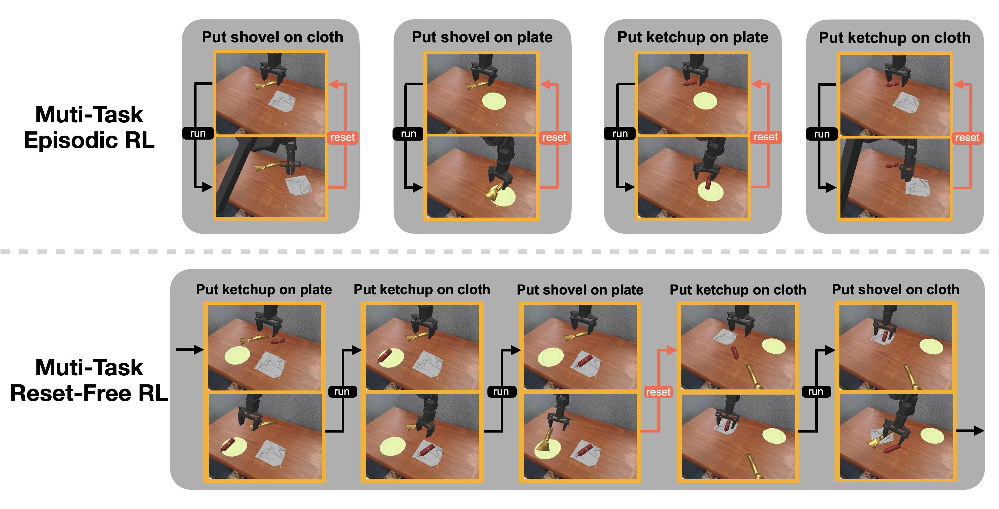

# CRONOS
This repository contains the code for the paper "CRONOS : Benchmarking Multi-Task Robotic Manipulation for Reset-Free Reinforcement Learning". CRONOS introduces a large-scale benchmark for studying multi-task robotic manipulation under a reset-free training protocol, and provides an empirical evaluation of representative reinforcement learning methods. The pretrained checkpoints are available at HuggingFace.




## Table of Contents
- [Install](#install)
- [Sensory Observations](#sensory-observations)
- [Action Space](#action-space)
- [Train](#train)
  - [Basic Configs](#basic-configs)
  - [Environment Configs](#environment-configs)
  - [Training Configs](#training-configs)
  - [Forward Backward](#forward-backward)
  - [Reset Unsuitable](#reset-unsuitable)
  - [FIFO Buffer](#fifo-buffer)
  - [Example](#example)
- [Evaluate](#evaluate)
  - [Single Task](#single-task)
  - [Sequential Task](#sequential-task)
  - [Collect Results](#collect-results)
- [Code Structure](#code-structure)
- [Object List](#object-list)
- [Plate List](#plate-list)

## Install
1. Clone the repository
    ```bash
    git clone git@github.com:Uber0802/Autonomous_RL.git
    ```
2. Move into the repository directory.
    ```bash
    export RFRL_ROOT=$(pwd)/Autonomous_RL
    cd $RFRL_ROOT
    ```
3. Create conda environment: cronos_env.
    ```bash
    conda create -n cronos_env -y python=3.10
    conda activate cronos_env
    ```
4. Run installation.
    ```bash
    chmod +x *.sh
    ./setup.sh
    ```
5. Optional: For ubuntu 2204
    ```bash
    sudo apt-get update
    sudo apt-get install -y libglvnd-dev
    ```


## Sensory Observations
This project uses ManiSkill digital-twin environments with `obs_mode="rgb+segmentation"`. Observations include:
1. **3rd-view RGB camera** — resolution `640x480` from `3rd_view_camera` (Logitech C920 intrinsics).
2. **3rd-view segmentation** — pixel-wise segmentation aligned with the RGB camera.

Note: the training/eval wrapper currently consumes the RGB image only (see `SimplerEnv/simpler_env/env/simpler_wrapper.py`).

## Action Space
The environment uses the control mode `arm_pd_ee_target_delta_pose_align2_gripper_pd_joint_pos`, exposed as a 7-DoF continuous action:
1. **Delta translation** — end-effector displacement in xyz (3).
2. **Delta rotation** — axis-angle rotation delta (3).
3. **Gripper command** — open/close (1), mapped to `-1` (close) or `+1` (open) in the wrapper.


## Train
All experiments are launched through `train.sh`.
Modify the script as needed, then run:
```bash
./train.sh
```
### Basic Configs
- `name`: WandB run name.
- `log`: Path to a `.txt` log file for training output.
- `vla_load_path`: Path to a pretrained VLA checkpoint. Use this to resume training from saved weights.
- `seed`: Random seed for reproducibility.
- `no_wandb`: Disable logging to Weights & Biases.

### Environment Configs
- `obj_set`: 
    - "fixed": Use identical scene and object layout across all environments.
    - "rand": Use random scene and object layout across all environments.
    - "rand_8": Use 8 different scenes and objects layout across all environments.
    - "rand_ood": For evaluating OOD.
- `obj1_index` and `obj2_index`: Choose an object using its index from the [Object List](#object-list). (Default: 7 and 2)
- `plate1_index` and `plate2_index`: Choose an plate using its index from the [Plate List](#plate-list).(Default: 1 and 2)

### Training Configs
- `max_episodes` : Total number of training episodes.
- `max_reset` : Total number of resets. (Default: 8192 = 128 episodes * 64 environments, 655360 steps for training_len=80)
- `training_len` : Rollout length (steps per episode). Examples: 80, 320, 1280, 2560.
- `training_interval` : Number of rollout steps between VLA training updates. (Default: 160)
- `instruction_switch_interval` : Number of rollout steps before switching to a new instruction. (Default: 80)
- `interval_eval` : Number of episodes between evaluation.
- `interval_save` : Number of episodes between saving model weights.
- `eval_at_start` : Enable evaluation at step 0.

### Forward Backward
- `enable_backward` : Enable forward backward training.
- `backward_interval` : Number of forward instructions between backward instruction. (Set to 1 for interleaved switch)

### Reset Gripper
- `no-reset-robot` : Disable reset gripper at every instruction switch.

### Reset Unsuitable
- `reset_unsuitable` : Reset environments that fail to complete the current task after an instruction switch.

### Task Order
- `random_task_order` : Randomize the task instruction order during training.

### Few Position
- `few_position` : Restrict to a single object position for training and in-domain evaluation.

### FIFO Buffer
Online + Offline Training
- `fifo_buffer`: Enable FIFO replay buffer.
- `fifo_length`: Maximum number of trajectories the buffer can store.

### Example
Example for 1280 Forward Backward with Reset Unsuitable.
```bash
python simpler_env/train_ms3_ppo.py \
  --name="bottle_shovel-1280-rand_scene-FB-seed_2" \
  --log="user/Autonomous_RL/bottle_shovel-1280-rand_scene-FB-seed_2.txt" \
  --env_id="TwoObjectTwoReceptacle-v1" \
  --vla_path="openvla/openvla-7b" --vla_unnorm_key="bridge_orig" \
  --training_len=1280 --max_episodes=8 \
  --interval_eval=1 --interval_save=1 \
  --enable_backward --backward_interval=1 \
  --reset_unsuitable \
  --seed=2 --obj_set="rand"
```

## Evaluate
Modify the `vla_load_paths` in `eval_ood.sh` or `./eval_seq.sh` to point to your model weights.
```bash
vla_load_paths=(
/path/to/your/first/model/weights
/path/to/your/second/model/weights
...
)
```

### Single Task
Set the `seed` and `obj_set` in `eval_ood.sh`.
Then run:
```bash
./eval_ood.sh
```

### Sequential Task
Set the `seed` and `obj_set` in `eval_seq.sh`.
Then run:
```bash
./eval_seq.sh
```
IMPORTANT!!! Use the same seed to ensure all evaluation use the same object locaiton,

### Collect Rsults
Collect success rates from evaluations.
1. Modify the `paths` in `collect_success_rates.sh` to point to your evaluation runs.
    ```bash
    paths=(
    /path/to/wandb/offline-run-1
    /path/to/wandb/offline-run-2
    ...
    )
    ```
2. Modify the `output_file` in `collect_success_rates.sh` to point to summary output file.
    ```bash
    output_file="success_summary.txt"
    ```
3. Run:
    ```bash
    ./collect_success_rates.sh
    ```

## Code Structure
### Autonomous_RL/ManiSkill/mani_skill/envs/tasks/digital_twins/
- bridge_dataset_eval/pick_place_multi.py: All environment implemented here.

### Autonomous_RL/SimplerEnv/simpler_env/
- train_ms3_ppo.py: All training and evaluation code.
- env/simpler_wrapper.py: Agent interact with the environment through here. 
- policies/openvla/openvla_train.py: PPO training algorithm.
- utils/replay_buffer.py: Replay buffer.


## Object List
Bridge dataset: carrot, plastic bottle, 7up can, kitchen spoon, cup

| Index | Object Name       |
|-------|-------------------|
| 1     | carrot            |
| 2     | kitchen shovel    |
| 3     | bread             |
| 4     | plastic bottle    |
| 5     | 7up can           |
| 6     | zuchinni          |
| 7     | ketchup bottle    |
| 8     | watering can      |
| 9     | pipe              |
| 10    | toy bear          |
| 11    | fast food cup     |
| 12    | plant             |
| 13    | banana            |
| 14    | hamburger         |
| 15    | golf ball         |
| 16    | BBQ sauce         |
| 17    | travel cup        |
| 18    | pepper            |
| 19    | nonstop can       |
| 20    | potato            |
| 21    | baguette          |
| 22    | champagne glass   |
| 23    | kitchen spoon     |
| 24    | onion             |
| 25    | cup               |

## Plate List
Bridge dataset: yellow_plate, cloth

| Index | Plate Name       |
|-------|-------------------|
| 1     | yellow_plate      |
| 2     | cloth             |
| 3     | carpet            |
| 4     | newspaper         |
| 5     | sheet metal       |
| 6     | drawing tablet    |
| 7     | tomato slice      |
| 8     | pizza             |
| 9     | flat bowl         |
| 10    | gramophone disk   |
| 11    | frying pan        |
| 12    | mouse pad         |
| 13    | cutting board     |
| 14    | chess board       |
| 15    | manhole cover     |
| 16    | envelope          |
| 17    | notepad           |
| 18    | black_plate       |
